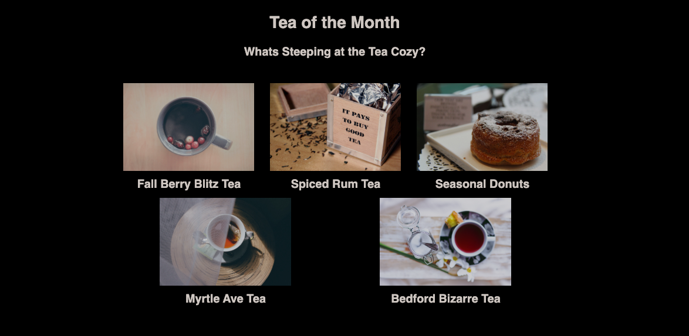

# tea-shop-website

### **Description:**
This is a website page for a fictional tea shop/business named 'Cozy Tea'. It provides information about seasonal products that the shop features, as well as shop locations and contact info. It is beautifully styled using alluring images and advanced CSS features with a primary focus on flexbox, flex-wrap, flex-flow, z-index layering, as well as positioning tactics. It also includes a fixed header to add character to the page.  
 
_____

### **Instructions for viewing Website**
*  Simply open the web page on any browser and use the provided navigation bar to peruse the provided information pertaining to the shop. 
 
_____

### **Demo Screenshots**
#####Cozy Tea
* Landing Area!

* Featured Products!

* Locations!

 
_________

### **Technologies Used**
* HTML5
* CSS
* Google-Fonts
 
_____

### **Built With**
* Visual Studio Code
